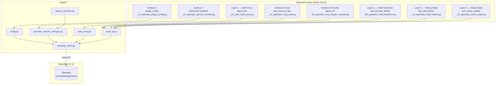

# OpenBao Secrets Plugin for Agent Zero

Replaces Agent Zero's default `.env`-based secrets management with [OpenBao](https://openbao.org/) KV v2 as the secrets backend.

## Status

**v0.1.0 — Replace Mode** (in development)

> **Upstream dependencies** — required PRs for `agent0ai/agent-zero:development`:
> - [#1377](https://github.com/agent0ai/agent-zero/pull/1377) — `extra_env` + `tool` in `tool_execute` extensions *(pending merge)*
> - [#1394](https://github.com/agent0ai/agent-zero/pull/1394) — `hook_context` in plugin config hooks *(pending merge)*
>
> **Already merged:**
> - ~~[#1379](https://github.com/agent0ai/agent-zero/pull/1379)~~ — sidebar extension points *(merged — commit `d357c24d`)*
> - ~~[#1395](https://github.com/agent0ai/agent-zero/pull/1395)~~ — `@extensible` on `set_settings` + `resolve_mcp_server_headers` *(merged — commit `d1196324`)*

---

## Table of Contents

- [Overview](#overview)
- [Architecture](#architecture--four-layer-secret-prevention)
- [Installation](#installation)
- [Configuration Reference](#configuration)
- [Authentication](#authentication)
- [API Endpoints](#api-endpoints)
- [Extension Hooks Reference](#extension-hooks-reference)
- [Secret Resolution](#secret-resolution)
- [Project-Scoped Secrets](#project-scoped-secrets)
- [Security Model](#security-model)
- [Failure Modes](#failure-modes)
- [Gotchas](#gotchas)
- [Project Structure](#project-structure)
- [Development](#development)
- [Upgrading](#upgrading)
- [Known Issues & Architectural Limitations](#known-issues--architectural-limitations)
- [OpenBao Target](#openbao-target)
- [License](#license)

---

## Overview

**What it does:** The `deimos_openbao_secrets` plugin replaces Agent Zero's built-in `.env` file secrets backend with [OpenBao](https://openbao.org/) (Vault-compatible) KV v2 as the authoritative secrets store. All secret values are stored in and retrieved from OpenBao — plaintext secrets never appear in `os.environ`, tool arguments, LLM history, or on-disk configuration files.

**How it integrates:** The plugin uses Agent Zero's `@extensible` hook system to intercept secrets at every stage of the agent lifecycle:

- **LLM provider credentials** are routed through an embedded auth proxy — the real keys are fetched from OpenBao at request time and injected into outbound HTTP headers
- **Plugin configuration secrets** are intercepted on save, extracted to OpenBao, and replaced with `bao:…` placeholder tokens on disk
- **MCP server auth headers** are scanned, vaulted, and resolved at HTTP transport time
- **Shell commands** receive resolved secret values in a subprocess environment — never through `os.environ`
- **Agent history** is scanned before every message — all known secret values are replaced with redacted aliases

**Credential surfaces covered:**

| Surface | What it protects | Mechanism |
|---------|-----------------|----------|
| Surface A | Plugin config fields (API keys, tokens) | `plugin_config` hook intercepts save/load |
| Surface B | MCP server auth headers | `tool_execute_after` scan + `agent_init` resolve |
| Surface C | `§§secret()` framework aliases | `get_secrets_manager()` returns OpenBao backend |

---

## Architecture — Four-Layer Secret Prevention

The plugin implements a defence-in-depth strategy across three intercepting layers and three credential surfaces.
Plaintext secrets **never** appear in `os.environ`, tool arguments, or LLM history.



### Layer Summary

| Layer | File | What it does |
|---|---|---|
| L1 — Proxy env | `helpers/auth_proxy.py` + `agent_init/_10_start_auth_proxy.py` | LLM provider env vars set to dummy `proxy-a0`. Real keys fetched from OpenBao and injected into outbound HTTP headers at proxy time — never in `os.environ` |
| L2 — Shell transform | `tool_execute_before/_05_openbao_shell_transform.py` | Before any shell command runs, replaces placeholder patterns so shell receives `$KEY_NAME` references resolved from a clean subprocess env |
| L3 — History mask | `hist_add_before/_10_openbao_mask_history.py` + `tool_output_update/_10_openbao_mask_output.py` | Scans every message before LLM history; replaces known secret values AND bao placeholder tokens with redacted form |
| Surface A — Plugin config | `plugin_config/_10_openbao_plugin_config.py` | Intercepts `save_plugin_config` hook; extracts matched secret fields to OpenBao KV v2; replaces values with bao placeholders on disk |
| Surface B — MCP headers | `tool_execute_after/_10_openbao_mcp_scan.py` + `agent_init/_20_openbao_mcp_header_resolver.py` | Scans `mcp_servers.json` on write; extracts auth headers to OpenBao; resolves placeholders at HTTP transport time |
| Surface C — §§secret() | `agent_init/_05_openbao_secrets_resolver.py` | Hooks `get_secrets_manager()`; returns `OpenBaoSecretsManager` as primary backend; `.env` becomes fallback-only |

### Resilience Stack

| Pattern | Library | Purpose |
|---|---|---|
| Retry | `tenacity` | Exponential backoff + jitter for transient failures |
| Circuit Breaker | `circuitbreaker` | Fail-fast when OpenBao is down |
| TTL Cache | Built-in | Avoid per-request API calls |
| Timeout | `httpx` | Bounded HTTP operations |
| Token Renewal | `hvac` | Lazy renewal on 403 / near-expiry |

---

## Installation

### Prerequisites

- Agent Zero framework with upstream `@extensible` hooks merged
- OpenBao v2.5.x OSS server (or HashiCorp Vault v1.15+)
- KV v2 secrets engine enabled at `secret/` mount point
- Python 3.11+

### Steps

**1. Clone the plugin into your Agent Zero plugins directory:**

```bash
cd /path/to/agent-zero
mkdir -p usr/plugins
git clone https://github.com/Deimos-AI/deimos_openbao_secrets.git usr/plugins/deimos_openbao_secrets
```

**2. Install Python dependencies:**

```bash
cd usr/plugins/deimos_openbao_secrets
pip install -r requirements.txt
```

> The plugin also auto-installs dependencies at load time via `helpers/deps.py` if any are missing.

**3. Create your configuration file:**

```bash
cp config.json.example config.json
```

Edit `config.json` with your OpenBao server details:

```json
{
  "enabled": true,
  "url": "https://vault.example.com:8200",
  "auth_method": "token",
  "mount_point": "secret",
  "secrets_path": "agentzero",
  "tls_verify": true,
  "hard_fail_on_unavailable": true
}
```

**4. Provision your vault token:**

Choose one of:

| Method | How | Recommended For |
|--------|-----|-----------------|
| Docker secrets | Mount at `/run/secrets/vault_token` | Production |
| Token file | Set `vault_token_file` in config.json, `chmod 600` the file | Production |
| Inline config | Set `vault_token` in config.json | Development only |

> `vault_token` is **NEVER** read from `os.environ`.

**5. Seed secrets into OpenBao:**

```bash
vault kv put secret/agentzero \
  OPENAI_API_KEY="sk-..." \
  ANTHROPIC_API_KEY="sk-ant-..." \
  GH_TOKEN="ghp_..."
```

**6. Enable the plugin:**

- In the Agent Zero UI: Settings → Plugins → Enable `deimos_openbao_secrets`
- Or set `"enabled": true` in `config.json`

**7. Verify connectivity:**

Use the **Test Connection** button in the plugin settings UI, or:

```bash
curl -X POST http://localhost:5000/api/plugins/deimos_openbao_secrets/health \
  -H 'Content-Type: application/json' \
  -d '{"config": {"url": "https://vault.example.com:8200"}}'
```

---

## Configuration

All fields are defined in `default_config.yaml` and may be overridden in the per-project `config.json`.
Environment variables take priority over `config.json` values where noted.

### Core Settings

| Field | Default | Env Var | Description |
|-------|---------|---------|-------------|
| `enabled` | `false` | — | Enable the OpenBao backend |
| `url` | `http://127.0.0.1:8200` | — | OpenBao server URL. **Use `https://` in production.** |
| `auth_method` | `token` | — | Authentication method: `token` or `approle` |
| `mount_point` | `secret` | — | KV v2 mount point |
| `secrets_path` | `agentzero` | — | Path within the KV v2 mount |

### TLS Settings

| Field | Default | Description |
|-------|---------|-------------|
| `tls_verify` | `true` | Verify TLS certificates |
| `tls_ca_cert` | `""` | Path to CA certificate bundle |

### Connection & Resilience

| Field | Default | Description |
|-------|---------|-------------|
| `timeout` | `10.0` | HTTP timeout in seconds |
| `cache_ttl` | `300` | Secret cache time-to-live in seconds. Rotated secrets may be stale for up to this duration. |
| `retry_attempts` | `3` | Max retry attempts (tenacity) |
| `circuit_breaker_threshold` | `5` | Consecutive failures before circuit opens |
| `circuit_breaker_recovery` | `60` | Circuit breaker recovery window in seconds |

### Failover Behaviour

| Field | Default | Description |
|-------|---------|-------------|
| `fallback_to_env` | `true` | Allow graceful degradation to `.env` when OpenBao is unavailable |
| `hard_fail_on_unavailable` | `true` | `true` = raise `OpenBaoUnavailableError` (default); `false` = graceful `.env` fallback |

> **Important:** `hard_fail_on_unavailable=true` (default) takes precedence over `fallback_to_env`. To enable graceful `.env` fallback, set `hard_fail_on_unavailable=false`.

### Namespace & Token

| Field | Default | Description |
|-------|---------|-------------|
| `vault_namespace` | `""` | OpenBao 2.5.x OSS namespace. Empty string = root namespace. |
| `vault_token_file` | `""` | Bootstrap token file path. Preferred over inline `vault_token` for production. |

### Surface A — Plugin Config Interception

| Field | Default | Description |
|-------|---------|-------------|
| `secret_field_patterns` | `["*key*", "*token*", "*secret*", "*password*", "*auth*"]` | fnmatch patterns matched against plugin config dict keys (case-insensitive). Matched fields containing string values are extracted to OpenBao on save. |

### Surface B — MCP Header Scanning

| Field | Default | Description |
|-------|---------|-------------|
| `mcp_header_scan_patterns` | `["Authorization", "X-API-Key", "X-Auth-Token"]` | Header keys in `mcpServers[*].headers` matching these names are extracted to OpenBao |
| `mcp_scan_paths` | `["**/mcp_servers.json", "**/.a0proj/mcp_servers.json"]` | Explicit MCP file scan targets (must be explicit paths, not wildcards) |

### Cross-Plugin Discovery

| Field | Default | Description |
|-------|---------|-------------|
| `plugin_sync_enabled` | `true` | Enable the `sync-plugins` endpoint for cross-plugin secret discovery. Set `false` in hardened environments. |

### Bootstrap Credentials

Order of precedence for `vault_token`:

1. **Docker secrets mount:** `/run/secrets/vault_token` (preferred for production)
2. **`vault_token_file` config field:** path to `chmod 600` file
3. **Inline `vault_token` in `config.json`** (development only)

> `vault_token` is **NEVER** read from `os.environ`.

---

## Authentication

### Token Auth (Default)

The simplest method. Provide a Vault/OpenBao token via one of the bootstrap methods above.

```json
{
  "auth_method": "token",
  "vault_token_file": "/run/secrets/vault_token"
}
```

### AppRole Auth (Recommended for Production)

AppRole is the recommended auth method for production. The session token is held in memory only
and renewed automatically. No static token is stored on disk.

#### Vault-Side Setup (one-time)

```bash
# Enable AppRole
vault auth enable approle

# Create policy
vault policy write agentzero-policy - <<EOF
path "secret/data/agentzero" { capabilities = ["read"] }
path "secret/data/agentzero-*" { capabilities = ["read"] }
EOF

# Create role
vault write auth/approle/role/agentzero \
    token_policies="agentzero-policy" \
    token_ttl=1h \
    token_max_ttl=4h

# Get role_id (non-sensitive — safe in config or env)
vault read auth/approle/role/agentzero/role-id

# Get secret_id (sensitive — put in env var, never in repo)
vault write -f auth/approle/role/agentzero/secret-id
```

#### Plugin Configuration

```json
{ "auth_method": "approle" }
```

Set credentials via environment (recommended) or plugin settings UI:

| Credential | Env Var | config.json key | Sensitive? |
|-----------|---------|-----------------|------------|
| role_id | `OPENBAO_ROLE_ID` (overrides) | `role_id` (written by UI) | No |
| secret_id | `OPENBAO_SECRET_ID` | never stored as value | Yes |

Env vars take priority over config.json values.
Token is held in memory only and renewed automatically via the existing renewal loop.

---

## API Endpoints

All endpoints are under `/api/plugins/deimos_openbao_secrets/` and require `POST` method.

### Health Check — `/health`

Tests connectivity and credentials against the configured OpenBao server using **only** the configured auth method.

**Request:**

```json
{
  "config": {
    "url": "https://vault.example.com:8200",
    "auth_method": "token",
    "vault_token": "s.xxxx"
  }
}
```

**Response (success):**

```json
{
  "ok": true,
  "message": "OpenBao connection successful",
  "version": "2.5.0"
}
```

**Response (failure):**

```json
{
  "ok": false,
  "error": "Connection refused at https://vault.example.com:8200"
}
```

> **SSRF protection:** URL parameters are validated for scheme (`http`/`https` only) and blocked hosts (`169.254.169.254`, `localhost`, `127.0.0.1`, `metadata.google.internal`).

### Secrets CRUD — `/secrets`

Manage secrets stored in OpenBao KV v2. All operations are scoped by `mount_point` and `secrets_path` from config.

**Authentication:** `requires_auth = true` — session cookie required.

#### List Keys

```json
{
  "action": "list",
  "project_name": ""
}
```

**Response:**

```json
{
  "ok": true,
  "keys": ["OPENAI_API_KEY", "GH_TOKEN", "LANGFUSE_PUBLIC_KEY"]
}
```

#### Get Key Value

```json
{
  "action": "get",
  "key": "OPENAI_API_KEY",
  "project_name": ""
}
```

**Response:**

```json
{
  "ok": true,
  "key": "OPENAI_API_KEY",
  "value": "sk-..."
}
```

> **Warning:** This returns plaintext secret values. Ensure your Agent Zero instance is not exposed to untrusted networks.

#### Set Key/Value Pairs

```json
{
  "action": "set",
  "pairs": [
    {"key": "NEW_API_KEY", "value": "sk-new-..."}
  ],
  "project_name": ""
}
```

#### Delete Key

```json
{
  "action": "delete",
  "key": "OLD_API_KEY",
  "project_name": ""
}
```

#### Bulk Set (dotenv format)

```json
{
  "action": "bulk_set",
  "text": "NEW_KEY=sk-new\nANOTHER_KEY=ghp-xxx",
  "project_name": ""
}
```

### MCP Credential Rotation — `/rotate_mcp`

Resolves all `[bao-ref:REDACTED]…` placeholders in the running MCP configuration to live values from OpenBao, then forces MCP reconnection with fresh auth headers.

The `mcp_servers` setting on disk retains placeholder strings unchanged. Only the in-memory `MCPConfig` instance receives live credential values.

**Request:**

```json
{}
```

**Response (success):**

```json
{
  "ok": true,
  "resolved_count": 3,
  "message": "MCP credentials rotated successfully"
}
```

### Cross-Plugin Sync — `/secrets` (action: `sync_plugins`)

Discovers secrets declared by other plugins (via their `plugin.yaml` `secrets:` field) and syncs values from `.env` to OpenBao. Enabled only when `plugin_sync_enabled: true`.

---

## Extension Hooks Reference

The plugin registers extensions at these Agent Zero hook points:

### Agent Initialization Hooks

| Hook Point | File | Purpose |
|-----------|------|---------|
| `agent_init` (priority 05) | `_05_openbao_secrets_resolver.py` | **Surface C** — Hooks `get_secrets_manager()`, returns `OpenBaoSecretsManager` as the primary `§§secret()` backend |
| `agent_init` (priority 10) | `_10_start_auth_proxy.py` | **Layer 1** — Starts embedded auth proxy, sets LLM provider env vars to `proxy-a0` sentinel |
| `agent_init` (priority 20) | `_20_openbao_mcp_header_resolver.py` | **Surface B** — Resolves `[bao-ref:REDACTED]` placeholders in MCP headers at HTTP transport time |

### Plugin Config Hooks

| Hook Point | File | Purpose |
|-----------|------|---------|
| `plugin_config` (priority 10) | `_10_openbao_plugin_config.py` | **Surface A** — Intercepts `save_plugin_config` / `get_plugin_config`. Extracts matched secret fields to OpenBao on save; resolves placeholders on read |

### Tool Execution Hooks

| Hook Point | File | Purpose |
|-----------|------|---------|
| `tool_execute_before` (priority 05) | `_05_openbao_shell_transform.py` | **Layer 2** — Resolves `bao:KEY` placeholders before shell commands execute. Hard error on unresolved placeholder — never passed to shell. |
| `tool_execute_before` (priority 15) | `_15_inject_terminal_secrets.py` | Injects resolved secret values into the terminal subprocess environment |
| `tool_execute_after` (priority 10) | `_10_openbao_mcp_scan.py` | **Surface B** — Scans `mcp_servers.json` on write; extracts auth headers to OpenBao with atomic rollback |
| `tool_execute_after` (priority 15) | `_15_cleanup_terminal_secrets.py` | Strips injected terminal secrets after command completes |

### History & Output Hooks

| Hook Point | File | Purpose |
|-----------|------|---------|
| `hist_add_before` (priority 10) | `_10_openbao_mask_history.py` | **Layer 3** — Scans every message before LLM history; replaces known secret values AND bao placeholder tokens with redacted aliases |
| `tool_output_update` (priority 10) | `_10_openbao_mask_output.py` | **Layer 3** — Masks secret values in tool output before LLM sees it |

### Factory Function Hooks

| Hook Point | File | Purpose |
|-----------|------|---------|
| `get_secrets_manager` | `_10_openbao_factory.py` | Returns singleton `OpenBaoSecretsManager` via `factory_common.get_openbao_manager()` |
| `get_default_secrets_manager` | `_10_openbao_default_factory.py` | Returns singleton default secrets manager |
| `get_project_secrets_manager` | `_10_openbao_project_factory.py` | Returns project-scoped secrets manager with PSK two-tier resolution |
| `get_api_key` | `_10_openbao_api_key.py` | Round-robin API key resolution from OpenBao |

---

## Secret Resolution

The plugin exposes **two distinct secret resolution paths** with different
semantics. Choosing the wrong path causes silent authentication failures.

### Path A — `§§secret()` aliases (LLM API calls only)

When the plugin starts, `_inject_proxy_env()` sets only LLM API key environment
variables — `OPENAI_API_KEY`, `ANTHROPIC_API_KEY`, `OPENROUTER_API_KEY` — to the
sentinel value `proxy-a0`. Other credentials such as `GH_TOKEN` are **not** set by
the proxy and must be retrieved via `resolve_secret()` (see REM-004). An embedded
auth-proxy at `127.0.0.1:{port}` intercepts outbound LLM API calls and transparently
replaces the sentinel with the real token from OpenBao at request time.

**This path only works for LLM API calls routed through the auth proxy.**
Git push, GitHub REST API, curl, and any other direct HTTP will receive
`proxy-a0` as the credential and fail authentication silently.

### Path B — `resolve_secret()` (git, HTTP APIs, direct tool use)

For **any context that is not an LLM API call**, use `resolve_secret()`:

```python
from deimos_openbao_secrets import resolve_secret

# Resolve a global secret -- always returns the real value
gh_token = resolve_secret("GH_TOKEN")
# => "gho_trcd..."  (real 40-char token, never "proxy-a0")

# Resolve with PSK project-specific override
lf_key = resolve_secret("LANGFUSE_PUBLIC_KEY", project_slug="my-project")
# => project-scoped value if present in vault, global value otherwise
```

**Resolution order:**

1. **OpenBao** — `get_openbao_manager().get_secret(key, project_slug)`
   - `project_slug` provided: project vault path checked first (PSK two-tier).
   - `proxy-a0` sentinel treated as absent (never returned).
2. **`os.environ`** — `.env` fallback when OpenBao is unavailable.
   - `proxy-a0` sentinel treated as absent (never returned).
3. **`None`** — key absent from all backends.

**Decision table:**

| Caller context | Correct path |
|---|---|
| LLM API call (OpenAI, Anthropic, OpenRouter) | `§§secret()` alias |
| `git push` / `git clone` over HTTPS | `resolve_secret("GH_TOKEN")` |
| GitHub REST API call | `resolve_secret("GH_TOKEN")` |
| Any direct HTTP call with auth header | `resolve_secret("MY_KEY")` |
| Shell command via `code_execution_tool` | `resolve_secret("MY_KEY")` |

### Safety Net — `hist_add_before` Masking

Regardless of which resolution path retrieved a secret value, all known secret values are
automatically masked before they enter agent history.
`extensions/python/hist_add_before/_10_openbao_mask_history.py` runs before every message
is written to history and replaces live secret values with secret-alias placeholder tokens.
Coverage includes:

- Global secrets from `secret/data/agentzero`
- Project-scoped secrets from `secret/data/agentzero-{project_slug}` (PSK-005)

No consumer action required. The masking layer is transparent and universal.

> **Rule:** Use the auth proxy for LLM API keys — automatic and transparent. Use `resolve_secret()` for everything else — explicit retrieval is the contract.

---

## Project-Scoped Secrets

The plugin supports **per-project secret overrides** using a two-tier vault path hierarchy:

    secret/data/agentzero                      <- global (shared across all agent contexts)
    secret/data/agentzero-{project_slug}       <- project override (active project only)

### Resolution Rule

1. When a project is active, the plugin checks the project-specific vault path first
2. Key found there — that value is used (project override wins)
3. Key absent or project vault document does not exist — global path used as fallback
4. No active project — only the global path is consulted (unchanged behaviour)

Consumer plugins (`langfuse_observation`, `straico`, etc.) require **no changes** — resolution is transparent.

### Project Slug Derivation

The project slug is the final path component of `agent.context.project`:

    # agent.context.project = "/a0/usr/projects/deimos-openbao-project"
    # project_slug          = "deimos-openbao-project"

### Provisioning a Project Vault Document

Create a project-specific document containing only the keys that differ from the global set:

    vault kv put secret/agentzero-deimos-openbao-project \
      LANGFUSE_PUBLIC_KEY="pk-lf-proj-xxxx" \
      LANGFUSE_SECRET_KEY="sk-lf-proj-xxxx"

The project vault document **does not need to replicate globally shared credentials** — only include keys that should differ from the global `secret/agentzero` document.

### Configuration Reference

| Config Field | Env Var | Default | Description |
|---|---|---|---|
| `vault_project_template` | `OPENBAO_PROJECT_TEMPLATE` | `agentzero-{project_slug}` | Naming template for project vault paths. Uses Python `str.format()` with `{project_slug}` as the substitution placeholder. |

Custom template example:

    export OPENBAO_PROJECT_TEMPLATE="myorg-{project_slug}"
    # Resolves to: secret/data/myorg-deimos-openbao-project

---

## Security Model

### Auth Proxy (Layer 1)

The embedded reverse proxy (`helpers/auth_proxy.py`) runs on `127.0.0.1:{random_port}` and intercepts all outbound LLM API calls:

1. LLM provider env vars (`OPENAI_API_KEY`, `ANTHROPIC_API_KEY`, `OPENROUTER_API_KEY`) are set to the sentinel value `proxy-a0` at startup
2. When the LLM SDK makes an HTTP request, it hits the auth proxy instead of the real provider
3. The proxy fetches the real API key from OpenBao, replaces the sentinel in the `Authorization` header, and forwards the request to the upstream provider
4. The response is relayed back unchanged

**Key property:** The real API key is never present in `os.environ` — only the sentinel `proxy-a0` lives there.

### Masking Layers (Layer 3)

Two independent masking passes ensure secrets never enter LLM visible context:

- **`hist_add_before`** — masks secrets before they enter agent history
- **`tool_output_update`** — masks secrets in tool output before LLM sees it

Both layers scan for all known secret values from OpenBao (global + project-scoped) and replace them with redacted aliases.

### CAS Protection

Surface A and Surface B use KV v2's versioned storage to prevent accidental overwrites:

- Atomic rollback on write failure — original file unchanged
- Idempotency guards prevent re-extraction of already-vaulted values
- SHA-256 dedup avoids storing duplicate secret values in the vault

### SSRF Guards

The `health.py` endpoint validates user-supplied URLs:

- Scheme allowlist: `http`, `https` only
- Blocked hosts: `169.254.169.254`, `metadata.google.internal`, `localhost`, `127.0.0.1`

### Path Sanitization

All user-supplied path components (project names, plugin names) pass through `_sanitize_component()` which strips:

- Path separators (`/`, `\`)
- Dot-dot sequences (`..`)
- Non-safe characters (only alphanumeric, `_`, `.`, `-` allowed)

---

## Failure Modes

| Scenario | Behaviour | Recovery |
|----------|-----------|----------|
| OpenBao unreachable, `hard_fail_on_unavailable=true` (default) | Hard fail: `OpenBaoUnavailableError` | Fix OpenBao connectivity, or set `hard_fail_on_unavailable=false` to enable `.env` fallback |
| OpenBao unreachable, `hard_fail_on_unavailable=false` | Graceful fallback to `.env` | Resolve OpenBao outage; secrets served from `.env` in the interim |
| KV write fails during Surface B scan | Atomic rollback — original file unchanged; exception raised | Check OpenBao logs for write permission issues |
| `bao` placeholder in shell arg, OpenBao unavailable | Hard error — never silently passed to shell | Fix OpenBao or remove the placeholder reference |
| MCP credential rotation needed | Click **Refresh MCP Credentials** in plugin settings, or `POST /api/plugins/deimos_openbao_secrets/rotate_mcp` | No agent restart required |
| Namespace token expires | `OpenBaoUnavailableError` on next KV read | Re-authenticate or re-provision token |
| Plugin own config intercepted (self-referential loop) | Prevented by bootstrapping exclusion guard | N/A — automatic |
| `write_if_absent` concurrent calls on same key | Last writer wins (no KV v2 CAS lock) | Avoid concurrent sync operations on the same vault path |
| `_vault_read` returns `None` on `Forbidden` (403) | Treated as key-not-found — may create duplicate vault entries | Ensure vault token has not expired; check token permissions |
| `secret_field_patterns` matches non-secret fields (e.g. `"*auth*"` matches `auth_method`) | Non-secret config values extracted to vault as if they were secrets | Tighten patterns — use more specific patterns like `"*api_key*"`, `"*api_token*"` |
| AppRole auth fails with fallback token present | Silent downgrade to static token auth | Remove fallback token from config when using AppRole exclusively |
| Cached secrets stale after rotation (up to `cache_ttl` seconds) | Rotated/revoked secrets continue to be served from cache | Reduce `cache_ttl`, or restart agent to force cache clear |

---

## Gotchas

### Critical Behaviour Quirks

1. **This plugin is an OpenBao CLIENT.** It never handles unseal keys. Configure auto-unseal at the OpenBao server level (AWS KMS, GCP CKMS, Azure Key Vault, or Transit auto-unseal).

2. **Unseal is per server instance** — all namespaces share the same seal state.

3. **`vault_token` is NEVER accepted from `os.environ`.** Use `vault_token_file` (Docker secrets mount at `/run/secrets/vault_token`) or inline config only.

4. **The `bao:…` placeholder scheme** (Unicode brackets U+27E6/U+27E7) is intentionally distinct from the `§§secret()` scheme to prevent interference with the framework's own unmask layer.

5. **Do NOT use literal `bao:…` placeholder characters in `code_execution_tool` args** — the shell guard will raise `ValueError`. Use Unicode escapes in Python source if needed.

6. **MCP credential rotation** requires clicking **Refresh MCP Credentials** or calling the `rotate_mcp` endpoint — agent restart not required.

7. **If `.env` stores shell variable references** (e.g. `GITEA_TOKEN=$GITEA_TOKEN`), Surface C bypasses them and serves the real value from OpenBao directly.

### Configuration Pitfalls

8. **`hard_fail_on_unavailable=true` (default) overrides `fallback_to_env=true`.** To enable graceful `.env` fallback, you must set `hard_fail_on_unavailable=false`. Having both as `true` means hard fail always wins.

9. **`secret_field_patterns: ["*auth*"]` matches non-secret fields.** The pattern `*auth*` matches `auth_method`, `auth_url`, `oauth_redirect` — legitimate non-secret config fields get extracted to vault and replaced with placeholders, breaking plugin configuration. Use specific patterns.

10. **`cache_ttl: 300` means rotated secrets may be stale for up to 5 minutes.** There is no mechanism to force cache invalidation across running agents without restart.

11. **Circuit breaker is applied to a locally-scoped inner function** — circuit state is never shared across calls. The circuit breaker never actually opens. OpenBao is retried on every cache miss even when fully down. This is a known architectural limitation.

### Security Considerations

12. **`_is_bao_ref` regex matches common config values.** The bare `ALL_CAPS` heuristic (`^[A-Z][A-Z0-9_]{2,}$`) matches `"NONE"`, `"TRUE"`, `"FALSE"`, `"DEBUG"`, `"INFO"`, `"TOKEN"`, `"HTTPS"`, `"JSON"`, `"ENABLED"`, `"APPROLE"` — all common plugin config values that are NOT vault references. Use the explicit `$bao:KEY` prefix format instead.

13. **Masking iteration order can leak substring secrets.** If Secret A's value is a substring of Secret B's value, and A is iterated first, B's remainder can leak into history. The fix is to sort by descending value length — scheduled for a future release.

14. **`deps.py` installs packages with minimum-version bounds and no hash verification.** A supply-chain attacker who compromises PyPI can inject code into the running Agent Zero instance. Pin exact versions with hashes in `requirements.txt` for production deployments.

15. **`SyncPlugins` transmits secret values over the network.** If `config.json` uses an `http://` URL, all migrated secrets are transmitted in plaintext. Use `https://` for all vault communication.

16. **AuthProxy forwards all non-hop-by-hop headers to upstream providers.** Internal framework headers (session tokens, debug headers) may be logged by third-party LLM providers.

### Integration Notes

17. **`hvac` private API access in `vault_io.py`.** The code accesses `manager._bao_client._client` and `bao._config.mount_point` — private attributes with no stability guarantee. An `hvac` minor version bump could silently break all vault I/O.

18. **Dynamic importlib loader fragility.** `factory_common.py` loads modules via `importlib.util.spec_from_file_location`. On hot-plugin-update, old module instances in `sys.modules` shadow new code silently. Restart the agent after plugin updates.

19. **`_init_attempted = True` is set before initialization completes.** If a transient network error occurs during init, `_init_attempted` is permanently `True` for the process lifetime — the plugin never recovers without a full process restart.

20. **Test mock format diverges from production.** `conftest.py` uses `"secret_alias(KEY)"` for masked values, while production uses the real placeholder format. Masking bugs producing subtly wrong formats would pass tests but fail in production.

---

## OpenBao Target

| Parameter | Value |
|---|---|
| Version | v2.5.x OSS (namespace support confirmed) |
| Secrets Engine | KV v2 (versioned) |
| Auth Method | Token (primary), AppRole (alternative) |
| Python Client | `hvac` (Vault API-compatible) |
| Docker Image | `ghcr.io/openbao/openbao:2.5.x` |

---

## Project Structure

```
plugin.yaml                          # Plugin metadata
hooks.py                             # Plugin lifecycle hooks + Alpine.js key normalisation
default_config.yaml                  # All configuration fields with defaults
config.json.example                  # Operational config template
requirements.txt                     # Python dependencies
helpers/
  config.py                          # Configuration loading and validation
  openbao_client.py                  # Resilient hvac client wrapper
  openbao_secrets_manager.py         # SecretsManager subclass (Surface C backend)
  auth_proxy.py                      # Reverse proxy for LLM provider auth (L1)
  factory_common.py                  # Shared manager singleton factory
  factory_loader.py                  # Factory module loader (REM-001)
  vault_io.py                        # Vault read/write/atomic-rollback primitives (REM-002)
  deps.py                            # Auto-install dependencies
api/
  health.py                          # POST /health — liveness + credential check
  secrets.py                         # POST /secrets — CRUD + sync-plugins
  rotate_mcp.py                      # POST /rotate_mcp — MCP credential rotation
extensions/python/
  agent_init/
    _05_openbao_secrets_resolver.py      # Surface C — §§secret() OpenBao backend
    _10_start_auth_proxy.py              # L1 — start auth proxy, inject dummy env
    _20_openbao_mcp_header_resolver.py   # Surface B — resolve bao: at transport
  plugin_config/
    _10_openbao_plugin_config.py         # Surface A — intercept plugin config saves
  tool_execute_before/
    _05_openbao_shell_transform.py       # L2 — resolve placeholders before shell
    _15_inject_terminal_secrets.py       # Inject secrets into terminal subprocess env
  tool_execute_after/
    _10_openbao_mcp_scan.py              # Surface B — scan/vault MCP headers on write
    _15_cleanup_terminal_secrets.py      # Strip injected terminal secrets after command
  hist_add_before/
    _10_openbao_mask_history.py          # L3 — mask secrets + bao tokens from history
  tool_output_update/
    _10_openbao_mask_output.py           # L3 — mask secrets in tool output
  _functions/
    helpers/secrets/get_secrets_manager/start/
      _10_openbao_factory.py             # Singleton manager factory
    helpers/secrets/get_default_secrets_manager/start/
      _10_openbao_default_factory.py     # Default secrets manager factory
    helpers/secrets/get_project_secrets_manager/start/
      _10_openbao_project_factory.py     # Project-scoped secrets manager factory
    models/get_api_key/start/
      _10_openbao_api_key.py             # Round-robin API key resolution
webui/
  config.html                        # Plugin settings UI (Alpine.js)
tests/
  conftest.py                        # sys.modules bootstrap for bare-name imports
  test_config.py                     # Configuration unit tests
  test_openbao_client.py             # Client resilience tests
  test_openbao_manager.py            # Manager behaviour tests
  test_auth_proxy.py                 # Auth proxy tests (REM-009)
  test_factory_common.py             # Factory singleton tests (REM-010)
  test_surface_a.py                  # Surface A integration tests (REM-011)
  test_surface_b.py                  # Surface B integration tests (REM-012)
  test_api_health.py                 # Health endpoint tests (REM-013)
  test_api_secrets.py                # Secrets CRUD endpoint tests (REM-013)
  test_api_rotate_mcp.py             # MCP rotation endpoint tests (REM-013)
  test_api_sync_plugins.py           # Cross-plugin sync tests
  test_surface_a_ref_resolution.py   # Surface A reference resolution tests (REM-014)
  test_vault_io_write_if_absent.py   # Vault I/O atomicity tests
  test_masking_strategy.py           # Masking strategy unit tests
  test_placeholder_mask.py           # Placeholder masking tests
  test_approle_auth.py               # AppRole authentication tests
  test_secret_resolver.py            # Secret resolver tests
  test_psk_resolution.py             # Project-scoped secret resolution tests
  ci_secret_surface_scan.py          # CI scan — detect raw secret exposure
```

---

## Development

### Prerequisites

```bash
pip install hvac tenacity circuitbreaker aiohttp pytest
```

### Run Tests

```bash
# Run full test suite
cd /path/to/deimos_openbao_secrets
pytest tests/ -v

# Run specific test file
pytest tests/test_surface_a.py -v

# Run with coverage
pytest tests/ -v --tb=short -q
```

**Current test suite:** 266 tests passing, 0 regressions.

### Test Architecture

Tests use `importlib.util.spec_from_file_location` for module loading (matching the production importlib pattern) and mock the following:

- `hvac.Client` — OpenBao API responses
- `helpers.extension` / `helpers.plugins` — Agent Zero framework hooks
- `sys.modules` — Module caching for factory singletons

No running OpenBao instance is required for tests. All vault interactions are mocked.

### Adding New Extensions

1. Create a new file in the appropriate `extensions/python/<hook_point>/` directory
2. Use the naming convention `_NN_description.py` where `NN` is the priority number (lower = earlier execution)
3. The function signature must match the hook point's expected signature
4. Add corresponding tests in `tests/`

### CI Pipeline

The `.github/workflows/plugin-lint.yml` workflow runs on push:

- Lint: syntax validation
- Secret surface scan: `ci_secret_surface_scan.py` detects raw secret exposure

---

## Upgrading

### REM-008 — `fallback_to_env_on_error` Renamed

The `fallback_to_env_on_error` config key has been **renamed** to `hard_fail_on_unavailable`
with **inverted semantics**:

| Old key | Old value | New key | New value | Behaviour |
|---------|-----------|---------|-----------|----------|
| `fallback_to_env_on_error` | `false` (default) | `hard_fail_on_unavailable` | `true` (default) | Hard fail: raises `OpenBaoUnavailableError` |
| `fallback_to_env_on_error` | `true` | `hard_fail_on_unavailable` | `false` | Graceful fallback to `.env` |

**Action required:** If you have `fallback_to_env_on_error` set in your `config.json`,
`default_config.yaml`, or `OPENBAO_FALLBACK_TO_ENV_ON_ERROR` env var, rename the key
and invert the boolean value. The `OPENBAO_FALLBACK_TO_ENV_ON_ERROR` env var is replaced
by `OPENBAO_HARD_FAIL_ON_UNAVAILABLE`.

### REM-032 — `config.json` Key Format Change (snake_case alignment)

Prior to REM-032, the settings modal wrote compound config keys in flat/camelCase format
(e.g. `authmethod`, `mountpoint`). `load_config()` now requires snake_case keys matching
the `OpenBaoConfig` dataclass field names exactly.

**Affected keys:**

| Old key (camelCase) | New key (snake_case) |
|---|---|
| `authmethod` | `auth_method` |
| `mountpoint` | `mount_point` |
| `secretspath` | `secrets_path` |
| `tlsverify` | `tls_verify` |
| `tlscacert` | `tls_ca_cert` |
| `cachettl` | `cache_ttl` |
| `retryattempts` | `retry_attempts` |
| `circuitbreakerthreshold` | `circuit_breaker_threshold` |
| `circuitbreakerrecovery` | `circuit_breaker_recovery` |
| `fallbacktoenv` | `fallback_to_env` |
| `terminalsecrets` | `terminal_secrets` |

**To migrate an existing `config.json`**, run this one-time script from the plugin root:

```bash
cd /path/to/deimos_openbao_secrets
python -c "
import json
with open('config.json') as f:
    data = json.load(f)
remap = {
    'authmethod': 'auth_method', 'mountpoint': 'mount_point',
    'secretspath': 'secrets_path', 'tlsverify': 'tls_verify',
    'tlscacert': 'tls_ca_cert', 'cachettl': 'cache_ttl',
    'retryattempts': 'retry_attempts',
    'circuitbreakerthreshold': 'circuit_breaker_threshold',
    'circuitbreakerrecovery': 'circuit_breaker_recovery',
    'fallbacktoenv': 'fallback_to_env', 'terminalsecrets': 'terminal_secrets',
    'roleid': 'role_id', 'secretidenv': 'secret_id_env',
    'secretidfile': 'secret_id_file',
}
fixed = {remap.get(k, k): v for k, v in data.items()}
with open('config.json', 'w') as f:
    json.dump(fixed, f, indent=2)
print('Migrated keys:', [k for k in data if k in remap])
"
```

New installations (settings saved after REM-032) are not affected — the modal now writes
correct snake_case keys automatically.

---


---

## Known Issues & Architectural Limitations

These are documented quirks and limitations — known at v0.1.0 and acknowledged as part of the architecture.

### SSRF Protection Blocks Localhost (F-07)

**What:** `api/health.py` blocks connections to `localhost` and `127.0.0.1` as part of the SSRF
protection guard. The health endpoint will reject any URL that resolves to a loopback address.

**Why:** Intentional production security posture — allowing arbitrary server-side HTTP requests
to loopback addresses is a classic SSRF vector.

**Impact:** Developers running OpenBao on the same host as Agent Zero cannot test vault
connectivity via the health endpoint using `http://localhost:8200` or `http://127.0.0.1:8200`.

**Workaround:**
- Use the Docker host gateway IP (e.g. `http://172.17.0.1:8200`) instead of `localhost`
- Use a custom DNS entry or hostname that resolves to a non-loopback address
- Test vault connectivity directly with `bao status` or `curl` from within the container

---

### Circuit Breaker Scope (F-08)

**What:** The circuit breaker is scoped to each `OpenBaoClient` instance, not shared globally
across requests. Failure counts do not accumulate across separate invocations.

**Why:** Architectural limitation — a global circuit breaker would require shared state across
async contexts, introducing its own complexity and race conditions.

**Impact:** The circuit breaker does not protect against cascading failures in the way a
global breaker would. If the vault is unavailable, each request independently probes it
rather than fast-failing based on accumulated failure state from prior requests.

**Planned improvement:** A future release may introduce a process-level singleton or shared
circuit breaker state via `asyncio`-safe globals.

---

### Transient Init Failures Require Restart (F-09)

**What:** The `_init_attempted` flag in `openbao_client.py` is set to `True` for permanent
failure cases (missing dependencies, invalid configuration). For transient network errors,
the init is intentionally NOT marked permanent, allowing retries.

**Failure scenario:** If a transient network error is misclassified as a permanent failure
during the first connection attempt, the `_init_attempted` flag is set and subsequent requests
fail immediately without attempting reconnection.

**Symptoms:** All secrets operations fail after the first transient error, with log messages
like `"OpenBao initialization already attempted — skipping"`.

**Recovery:** Restart Agent Zero to reset the `_init_attempted` state.

**Mitigation:** Ensure OpenBao is reachable and healthy before enabling the plugin. Set
`hard_fail_on_unavailable: false` in `config.json` to allow graceful fallback to `.env` files
when OpenBao is unavailable — this prevents a single transient error from disabling all
secret resolution.

## Issue Tracker

See [GitHub issues](https://github.com/Deimos-AI/deimos_openbao_secrets/issues) for planned work.

## License

Apache 2.0 — see [LICENSE](LICENSE) for details.
