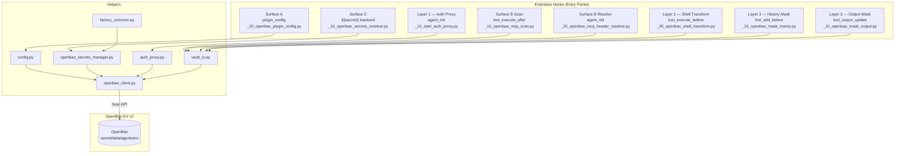

# Architecture — Four-Layer Secret Prevention

The plugin implements a defence-in-depth strategy across three intercepting layers and three credential surfaces.
Plaintext secrets **never** appear in `os.environ`, tool arguments, or LLM history.

## Layer Summary

| Layer | File | What it does |
|---|---|---|
| L1 — Proxy env | `helpers/auth_proxy.py` + `agent_init/_10_start_auth_proxy.py` | LLM provider env vars set to dummy `proxy-a0`. Real keys fetched from OpenBao and injected into outbound HTTP headers at proxy time — never in `os.environ` |
| L2 — Shell transform | `tool_execute_before/_05_openbao_shell_transform.py` | Before any shell command runs, replaces placeholder patterns so shell receives `$KEY_NAME` references resolved from a clean subprocess env |
| L3 — History mask | `hist_add_before/_10_openbao_mask_history.py` + `tool_output_update/_10_openbao_mask_output.py` | Scans every message before LLM history; replaces known secret values AND bao placeholder tokens with redacted form |
| Surface A — Plugin config | `plugin_config/_10_openbao_plugin_config.py` | Intercepts `save_plugin_config` hook; extracts matched secret fields to OpenBao KV v2; replaces values with bao placeholders on disk |
| Surface B — MCP headers | `tool_execute_after/_10_openbao_mcp_scan.py` + `agent_init/_20_openbao_mcp_header_resolver.py` | Scans `mcp_servers.json` on write; extracts auth headers to OpenBao; resolves placeholders at HTTP transport time |
| Surface C — §§secret() | `agent_init/_05_openbao_secrets_resolver.py` | Hooks `get_secrets_manager()`; returns `OpenBaoSecretsManager` as primary backend; `.env` becomes fallback-only |

## Resilience Stack

| Pattern | Library | Purpose |
|---|---|---|
| Retry | `tenacity` | Exponential backoff + jitter for transient failures |
| Circuit Breaker | `circuitbreaker` | Fail-fast when OpenBao is down |
| TTL Cache | Built-in | Avoid per-request API calls |
| Timeout | `httpx` | Bounded HTTP operations |
| Token Renewal | `hvac` | Lazy renewal on 403 / near-expiry |
